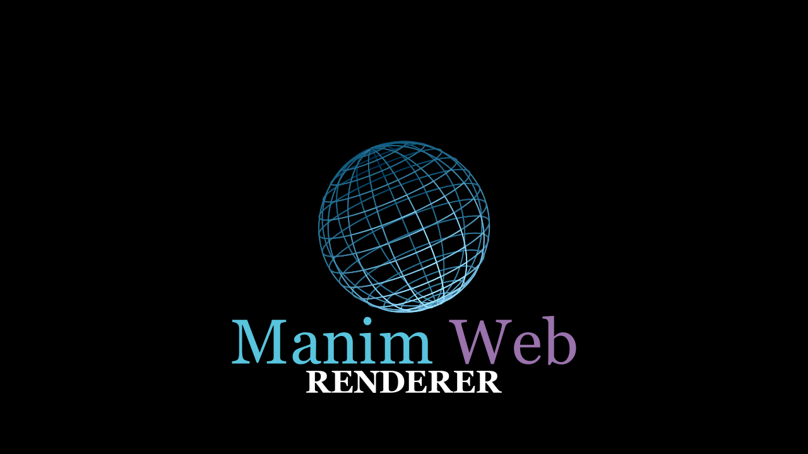

# Manim Web Renderer


A modern web interface to render Manim (Mathematical Animation Engine) scripts directly from your browser. Upload .py files or write code in the editor, and see results instantly.



## Features

*   **Web Code Editor:** Write Manim scripts in the browser.
*   **Drag & Drop:** Easy file upload.
*   **Configurable:** 4K support, Vertical Mode (Shorts/TikTok), Transparent background.
*   **Live Terminal:** Real-time log streaming with privacy masking.
*   **Privacy:** System paths are hidden in logs.
*   **Multi-language:** Auto-detects English, Spanish, or Portuguese.

## Installation

### Prerequisites
1.  **Python 3.8+**
2.  **FFmpeg** (Required system dependency for Manim)
3.  **LaTeX** (Optional, for mathematical formulas)

### Setup

1.  Clone the repository:
    ```bash
    git clone https://github.com/your-username/manim-web-renderer.git
    cd manim-web-renderer
    ```

2.  Create a virtual environment:
    ```bash
    python -m venv venv
    # Windows
    venv\Scripts\activate
    # Mac/Linux
    source venv/bin/activate
    ```

3.  Install dependencies:
    ```bash
    pip install -r requirements.txt
    ```

## Usage

1.  Start the local server:
    ```bash
    python server.py
    ```

2.  Open your browser and navigate to:
    http://localhost:8000

## License & Usage

*   **Content:** You can create, upload, and **monetize** videos made with this tool.
*   **Software:** You cannot sell this software or use strictly its code for commercial products. 

See `LICENSE` for details.
